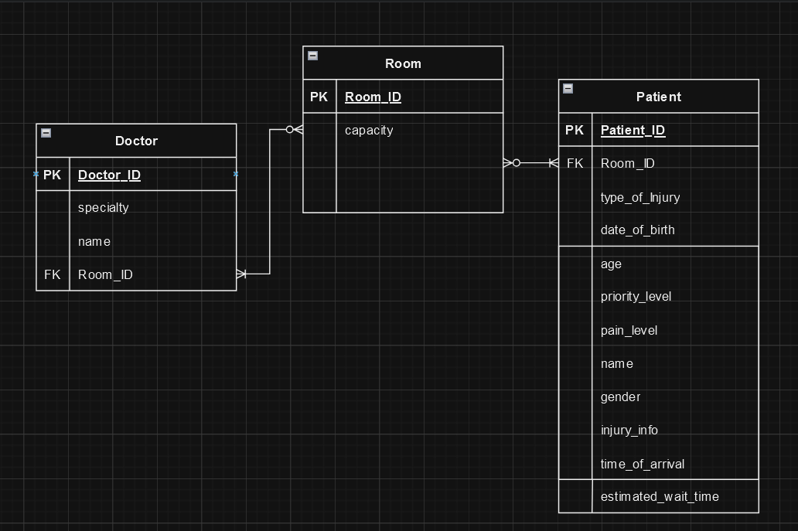

# Hospital Triage Database Design Documentation

## Entities Description

### Patients

This entity stores all the data about the patients. It includes personal details and medical triage information.

### Doctor

This entity stores all data about the doctors. It includes the name and their specialty

### Room

This entity contains details about the rooms available for patient care. It tracks the status of each room and the medical personnel assigned.

## Attributes Specification

### Patients Attributes:

- `Patient_id` (integer): A unique identifier for each patient.
- `Room_id` (integer): A unique identifier for each room.
- `type_of_Injury` (varchar): type of injury.
- `date_of_birth` (date): the patient`s birthday.
- `priority_level` (integer): integer indicating patient urgency level.
- `estimated_wait_time` (integer): the patient-specific wait time.
- `time_of_arrival` (timestamp): time the patient arrived.
- `pain_level` (integer): integer representing the patient`s level of pain.
- `name` (varchar): patient`s name.
- `gender` (varchar): patient`s gender.
- `age` (integer): patient`s age.
- `injury_info` (varchar): any additional info on the patient`s injury.
    

### Doctor Attributes:

- `Doctor_ID` (integer): A unique identifier for the doctor.
- `Room_id` (integer): A unique identifier for each room.
- `name` (varchar): doctor`s name.
- `specialty` (varchar): the doctor`s specialty

### Rooms Attributes:

- `Room_id` (integer): A unique identifier for each room.
- `capacity` (integer): The room`s capacity

## Database ERD (Entity-Relationship Diagram)

The ERD illustrates the relationships between entities. The `Rooms` entity is connected to the `Doctor` and `Patient` entities through foreign keys, indicating the relationship between a patient`s status, urgency level and their room assignment. The ERD is for patient information and room management.
