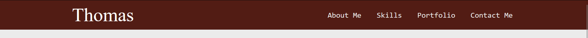

# Thomas Lawrence's Portfolio Design System Documentation

This documentation provides a clear and simplified overview of the design system used for the portfolio project. It includes colors, typography, components, and layouts, along with screenshots of mock-ups for clear communication of the design.

## **1. Color Palette**
We use a simple and clear color palette throughout the design.

- **Primary Color:** `#FFF`
- **Text Color:** `#000`
- **Border Color:** `#521C14`
- **Background Color:** `#EBEBEB`

## **2. Typography**
- **Body Text:** `Andale Mono, monospace`
- **Headers:** `Andale Mono, monospace`

## **3. Components and Layout**
### Header
- **Design:** Left Aligned title with righ align navigation items with a Caput Mortuum background.
- **Mock-up Screenshot:**

### Navigation
- **Design:** Caput Mortuum background with white text links.
- **Mock-up Screenshot:**

### Content
- **Design:** Centered section with light grey background.
- **Mock-up Screenshot:**

### Footer
- **Design:** Four centered sections with text on a light grey background.
- **Mock-up Screenshot:**

## **Conclusion**
This documentation serves as a concise reference guide for the design system used in the portfolio project, aiming to facilitate development and maintain consistency in design throughout the project.
